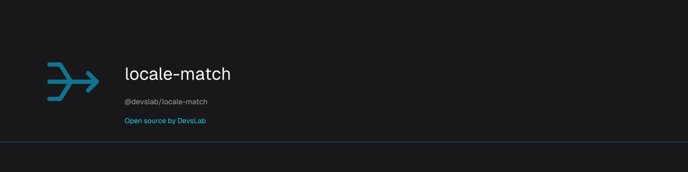

# locale-match

<p align="center">
  <a href="https://devslab.kr/brand/open-source/"></a>
</p>

**Open source by [DevsLab](https://devslab.kr/)** · [OSS brand guide](https://devslab.kr/brand/open-source/) · Registry O07

[](https://www.npmjs.com/package/@devslab/locale-match)
[](https://github.com/devslab-kr/locale-match/actions/workflows/ci.yml)

[](./LICENSE)

**[Docs & playground](https://devslab-kr.github.io/locale-match/)** · [Changelog](CHANGELOG.md) · [한국어](README.ko.md)

Locale negotiation that will not hand a Simplified Chinese reader your Traditional text.
Zero dependencies; runs in Node, Bun, Deno, Cloudflare Workers, and the browser.

## Packages

| Package | Description |
|---|---|
| [`@devslab/locale-match`](packages/locale-match) | Core: matching, `Accept-Language` parsing, the precedence chain, and script guards. Zero dependencies, framework-free, CDN-ready IIFE build. |
| [`@devslab/locale-match-react`](packages/locale-match-react) | React `<LocaleProvider>` + `useLocale()`. Hydration-safe. |
| [`@devslab/locale-match-vue`](packages/locale-match-vue) | Vue 3 plugin + `useLocale()` composable. |
| [`@devslab/locale-match-nuxt`](packages/locale-match-nuxt) | Nuxt module — resolves during SSR, so the page never changes language after it paints. |

## The problem

Most languages are decided by their tag alone. `ko` means Korean, `de` means
German — there is nothing else to know.

Chinese is the exception, and it is a large one. A bare `zh` is silent about the
only thing that matters — **Simplified or Traditional** — and both scripts have
hundreds of millions of readers. If you publish Traditional for Taiwan and Hong
Kong, a mainland reader arriving with `zh-CN` should *not* get your Traditional
text. They should get their next language, usually English.

Naive detection gets this wrong in a specific way:

```js
// The bug almost everyone writes
const base = tag.split('-')[0];       // 'zh-CN' becomes 'zh'
if (base === 'zh') return 'zh-TW';    // ...and Simplified readers get Traditional
```

And there is a second trap behind it. Suppose you fix the above by refusing
`zh-CN`. A mainland browser does not send `zh-CN` alone — it sends:

```
Accept-Language: zh-CN,zh;q=0.9
```

The bare `zh` sitting right behind the tag you just refused **rescues it**, and
the page comes back Traditional anyway. We measured exactly this in production
on 2026-08-21.

So the rule has two tiers, and this library implements both:

| where the tag came from | a bare `zh` means |
|---|---|
| **one declared value** — `?lang=`, a cookie, a saved setting | *accept* — they asked for Chinese and you have Chinese |
| **an entry in a ranked list** — `Accept-Language`, `navigator.languages` | *refuse* — in a ranked list a vague entry rescues a precise one |

## Quick start

```ts
import { createLocaleResolver } from '@devslab/locale-match';

const locales = createLocaleResolver({
  supported: ['ko', 'en', 'ja', 'zh-HK', 'zh-TW', 'fr'],
  fallback: 'ko',
});

// Server (Workers, Node, anywhere with a Request)
const { locale } = locales.resolve({
  query: url.searchParams.get('lang'),
  cookieHeader: request.headers.get('cookie'),
  acceptLanguage: request.headers.get('accept-language'),
});

// Browser: ?lang= then localStorage then navigator.languages
const { locale } = locales.resolveInBrowser();
```

The Chinese guard is **on by default**, derived from the list you just wrote.
Traditional-only `supported` installs a Traditional guard; Simplified-only
installs a Simplified one; publish both scripts (or no Chinese) and no guard is
installed, because there is nothing to protect.

This is not a guess about your visitors — it reads a list *you* declared.

```ts
// Opt out entirely
createLocaleResolver({ supported, fallback: 'ko', guards: [] });

// Or say it explicitly
import { chineseGuard } from '@devslab/locale-match';
createLocaleResolver({ supported, fallback: 'ko', guards: [chineseGuard('simplified')] });
```

## Adding a guard for another language

Chinese ships built in because it is the case that bites almost everyone. The
mechanism is not Chinese-specific — **any language whose readers are split by
script can use it**, and adding one takes a few lines.

A guard answers one question, in three values, for one base language:

| verdict | meaning | example, publishing Latin Serbian |
|---|---|---|
| `supported` | the tag names the script you publish | `sr-Latn` |
| `unsupported` | the tag names the other script | `sr-Cyrl` |
| `unspecified` | this language, silent about script | `sr` |

```ts
import { defineScriptGuard, createLocaleResolver } from '@devslab/locale-match';

const serbianLatin = defineScriptGuard({
  language: 'sr',                        // base subtag, lowercase
  supported: /^sr-(latn|latin)\b/,       // both tested against the LOWERCASED tag
  unsupported: /^sr-(cyrl|cyrillic)\b/,
});

const locales = createLocaleResolver({
  supported: ['en', 'sr-Latn'],
  fallback: 'en',
  // Listing guards yourself replaces the automatic Chinese one — add it back
  // if you publish Chinese as well.
  guards: [serbianLatin],
});
```

Three things to get right when you write one:

1. **Cover the regions, not only the script codes.** People write `sr-RS`, not
   just `sr-Cyrl`. Our Chinese guard treats `zh-TW`, `zh-HK`, `zh-MO` as
   Traditional and `zh-CN`, `zh-SG`, `zh-MY` as Simplified for exactly this
   reason. Look up which regions use which script before you ship.
2. **Leave the bare tag `unspecified`.** Do not classify `sr` as either. Let the
   two-tier rule handle it: accepted when someone declared it, refused inside a
   ranked list.
3. **Anchor your patterns.** Start with `^` and end with a word boundary, so
   `sr-Latn` matches and a longer unrelated tag does not.

Languages worth a guard if they apply to you: Serbian (Cyrl/Latn), Mongolian
(Mong/Cyrl), Punjabi (Guru/Arab), Kurdish (Latn/Arab), Uzbek (Latn/Cyrl).
**Pull requests adding well-researched guards are welcome** — please include the
region mapping and a test using a real browser header.

## Matching behaviour

Strict RFC 4647 "lookup" only ever truncates: `pt-PT` becomes `pt`, and if you
publish `pt-BR` but not `pt`, your Portuguese reader falls all the way to
English. Correct by the letter, wrong in practice.

So this matcher takes the sideways step — same base language, any region:

```ts
matchLocale('pt-PT', ['pt-BR', 'en']);   // 'pt-BR'
matchLocale('en-GB', ['en', 'ko']);      // 'en'
```

That step is what makes the library useful, and it is exactly the step that is
wrong for Chinese. The two features are halves of one design: **jump sideways by
default, and refuse to for the languages where script — not region — separates
the readers.**

Order of attempts: exact match, then progressive truncation (`zh-Hant-TW` to
`zh-Hant` to `zh`), then sideways to any locale sharing the base language, in
*your* `supported` order — so you control the tie-break.

## Precedence

`resolve()` runs one chain:

1. **query** — `?lang=`. The *publisher's* declaration: whoever sent the link
   decided what it opens in.
2. **stored** — your cookie or `localStorage` value. The reader's own past choice.
3. **browser** — `Accept-Language` or `navigator.languages`. The reader's
   standing declaration about the device in their hand.
4. **fallback**.

What is deliberately *not* in the chain: anything inferred. IP geolocation says
where the packet came from, not what the person reads. Suggest on it if you like
— but that is a banner, not a switch.

`resolve()` returns `{ locale, source, shouldPersist }`, so you can tell a real
match from a fallback and decide whether to write a cookie.

## Vue

```bash
npm i @devslab/locale-match @devslab/locale-match-vue
```

```ts
// main.ts
import { createLocalePlugin } from '@devslab/locale-match-vue';

const locales = createLocalePlugin({
  supported: ['ko', 'en', 'ja', 'zh-HK', 'zh-TW'],
  fallback: 'ko',
  // initial: serverResolvedLocale,   // set this when you render on a server
});
app.use(locales);
```

```vue
<script setup lang="ts">
import { useLocale } from '@devslab/locale-match-vue';
const { locale, setLocale, supported, isFallback } = useLocale();
</script>

<template>
  <select :value="locale" @change="setLocale($event.target.value)">
    <option v-for="l in supported" :key="l" :value="l">{{ l }}</option>
  </select>
</template>
```

## Nuxt

```bash
npm i @devslab/locale-match @devslab/locale-match-vue @devslab/locale-match-nuxt
```

```ts
// nuxt.config.ts
export default defineNuxtConfig({
  modules: ['@devslab/locale-match-nuxt'],
  localeMatch: {
    supported: ['ko', 'en', 'ja', 'zh-HK', 'zh-TW'],
    fallback: 'ko',
  },
});
```

`useLocale()` is auto-imported. The module resolves the locale **during SSR**
from the request's own `Accept-Language` and cookie, serializes it into the
payload, and the client agrees rather than re-detecting — so the page never
changes language after it paints, and hydration cannot mismatch.

Requires Nuxt 3.8 or newer.

## React

```bash
npm i @devslab/locale-match @devslab/locale-match-react
```

```tsx
import { LocaleProvider, useLocale } from '@devslab/locale-match-react';

export function App({ serverLocale }) {
  return (
    <LocaleProvider
      supported={['ko', 'en', 'ja', 'zh-HK', 'zh-TW']}
      fallback="ko"
      initial={serverLocale}   // omit in a pure SPA
    >
      <Page />
    </LocaleProvider>
  );
}

function Page() {
  const { locale, setLocale, supported, isFallback } = useLocale();
  return (
    <select value={locale} onChange={(e) => setLocale(e.target.value)}>
      {supported.map((l) => <option key={l}>{l}</option>)}
    </select>
  );
}
```

Detection runs in an effect **after mount**, never during render. Server-rendered
HTML — including a static export — carries whatever locale the server knew, and
disagreeing on the first client render is a hydration mismatch, which React
resolves by throwing the server's markup away. The cost is one frame of the
fallback language before the swap. Pass `initial`, resolved on the server, and
there is no frame to lose.

## Next.js

Next needs no adapter — its integration points are plain function calls, and the
core is a plain function.

```ts
// middleware.ts
import { NextResponse, type NextRequest } from 'next/server';
import { createLocaleResolver } from '@devslab/locale-match';

const locales = createLocaleResolver({
  supported: ['ko', 'en', 'ja', 'zh-HK', 'zh-TW'],
  fallback: 'ko',
});

export function middleware(request: NextRequest) {
  const { locale } = locales.resolve({
    query: request.nextUrl.searchParams.get('lang'),
    cookieHeader: request.headers.get('cookie'),
    acceptLanguage: request.headers.get('accept-language'),
  });
  const response = NextResponse.rewrite(
    new URL(`/${locale}${request.nextUrl.pathname}`, request.url),
  );
  // See the warning below.
  response.headers.set('Vary', 'Accept-Language');
  return response;
}
```

```ts
// or in a server component — pass the answer to <LocaleProvider initial={...}>
import { headers } from 'next/headers';

const { locale } = locales.resolve({
  acceptLanguage: (await headers()).get('accept-language'),
  cookieHeader: (await headers()).get('cookie'),
});
```

> **Set `Vary: Accept-Language` on any response you vary this way.** A cache that
> does not know the response depends on that header will serve one visitor's
> language to the next. We shipped that bug in production; it is not theoretical.

A dedicated `-next` package is deliberately not published yet: it would wrap a
one-line call, and we do not run Next.js SSR ourselves, so we could not honestly
claim the server half was proven.

## No build step

The core ships an IIFE bundle, so a plain HTML page can use it from a CDN:

```html
<script src="https://unpkg.com/@devslab/locale-match/dist/index.global.js"></script>
<script>
  const locales = LocaleMatch.createLocaleResolver({
    supported: ['ko', 'en', 'zh-HK', 'zh-TW'],
    fallback: 'ko',
  });
  document.documentElement.lang = locales.resolveInBrowser().locale;
</script>
```

## Why not an existing library?

You may not need this one.

- **[`@formatjs/intl-localematcher`](https://www.npmjs.com/package/@formatjs/intl-localematcher)**
  implements the spec's matching algorithms properly. Its `lookup` mode will not
  jump sideways — which means it avoids the Chinese bug, and also means `pt-PT`
  gets you English instead of `pt-BR`. Its `best fit` mode can match across
  scripts. Neither mode decides your script policy for you.
- **`i18next-browser-languagedetector`** gives you the detection *order*
  (querystring, cookie, localStorage, navigator). Its `load: 'languageOnly'`
  option strips the region — which reintroduces the exact bug this library
  exists to prevent.
- **`next-intl`**, **`vue-i18n`** and friends are full i18n frameworks. If you
  already run one, keep it, and use this only for the negotiation step.

What this library adds is the part none of them decide: **which script you
publish, and what to do with a reader who asked for the other one.**

## License

Apache-2.0 © devslab
